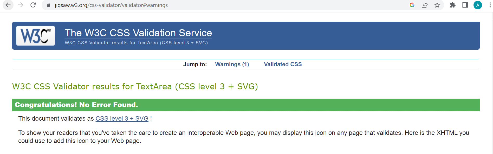
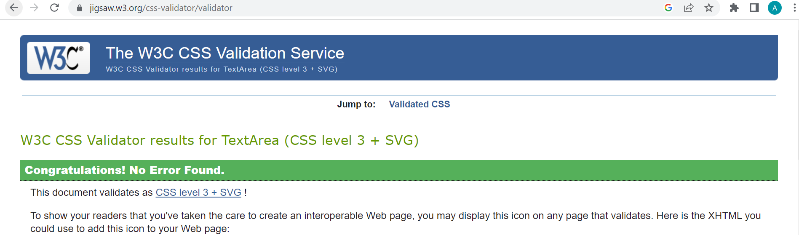
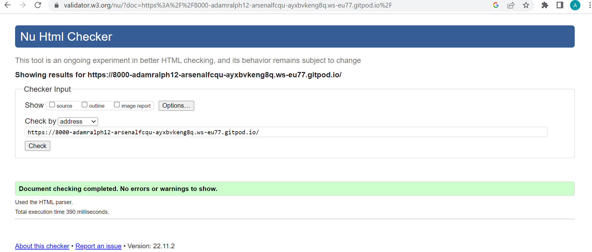
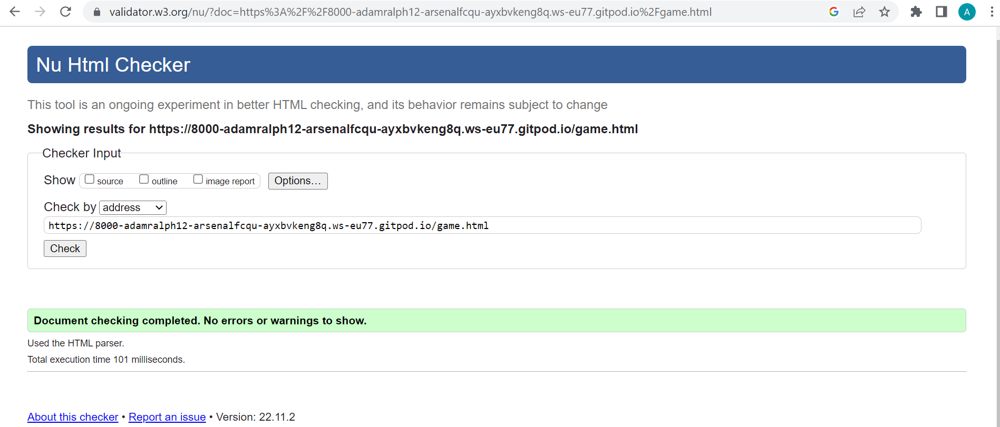
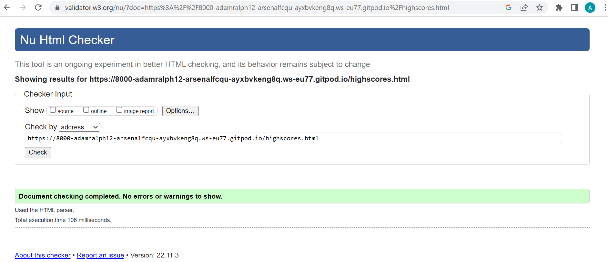
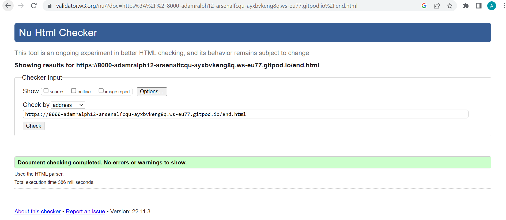

# Portfolio project - 2 JavaScript

# Arsenal F.C. Quiz

[Here is a link to the live site - Arsenal F.C. Quiz](https://adamralph123.github.io/Arsenal-F.C.-Quiz/)

Welcome to my Arsenal F.C. Quiz! The quiz has a home button, play button and highscores button so the user can enter their name and it will appear in the leaderboard.

# Table of contents
1. [Overview](#overview)
2. [Features](#features)
    * [Header](#header)
    * [Index page](#index-page)
    * [Footer section](#footer-section)
    * [Quiz page](#quiz-page)
    * [End page](#end-page)
    * [Highscores page](#highscores-page)
3. [User stories](#user-stories)
4. [Technology used](#technology-used)
5. [Testing](#testing)
    * [JavaScript (JS hint)](#javascript-jshint)
    * [Css (Jigsaw)](#css-jigsaw)
    * [HTML (W3C validator)](#html-validator-w3c)
6. [Bugs](#bugs)
7. [Deployment](#deployment)
8. [Credits](#credits)
    * [Code](#images)
    * [Images and Icons](#images-and-icons)
9. [Acknowledgement](#acknowlegement)

---
# Overview

This is an interactive quiz that keeps track of the users score and keeps track of what question they are on.

When the users chooses the correct answer the choice answer they picked will turn green and when they choose the wrong answer the choice answer will turn red.

The quiz is based on a football club based in England called Arsenal F.C. which has 10 questions about the football club.

The purpose of this quiz is to test the knowledge of Arsenal F.C. fans or anyone who would like to know more about Arsenal F.C. .

---

# Features

## Header
The Header consists of the quiz name and has a font-family of Oswald, I chose this font as I thought it was simple and would suit this quiz. The header has a background color of black with white text. The header is also used across all pages of this quiz.

## Index page
The index page is the home page of this quiz it has an image of the Arsenal F.C. logo in the center of the screen and has text underneath the image for the user to get ready for the quiz. There is also a functional play button that starts the quiz and a highscores button that brings you to the highscores page. I chose the background color for the index page to be firebrick as this is a similar color to Arsenal F.C. club color.

## Footer section
The footer has two icons which will take users to my LinkedIn and my GitHub.

## Quiz page
The quiz page inludes;
<ul>
<li>A home button that when clicked it will bring you back to the home page.</li>
<li>A progress bar that tells its users what question they are on, after each question the bar will load green until all questions are answered.</li>
<li>A score tracker which will tell its users what score they will have after each question.</li>
<li>A random question each time the user plays the quiz.</li>
<li>Four choices of answers which are listed A-D, when the user chooses the correct answer the choice they picked will appear green and when the user chooses the wrong answer the choice they picked will appear red and it will show the correct answer in green and will move onto the next question.</li>
</ul>

## End page
The end page of this quiz will show its user what score they got and will ask them to enter their name below to save their score, it has 3 buttons;<ul>
 <li>a save buttton that when pressed will bring you back to the home page, if you try to press save without entering your name or if you enter a name with less than 3 letters a text will appear asking you to enter more than 3 letters.</li>
 <li>A play again button that will start the quiz again, if the user wishes to play again.</li>
 <li>A go home button that will bring the user back to the home page.</li>
 </ul>

 ## Highscores page
 The highscores has an icon of a trophy and a numbered leaderboard with the highest score on top, the users name will appear along with the score they got. There is also a go home button that will take the user to the home page.

---

# User Stories
Below is a screenshot of my finished project.
.png)
.png)
.png)
.png)

--- 

# Technology used
<ul>
<li>HTML was used 30.6% of this quiz, i made 4 seperate html files to help structure this quiz.</li>
<li>CSS was used 21.4% of this quiz, i made 3 seperate css files to design each section of this quiz.</li>
<li>JavaScript was used 28.2% which helped function the entire quiz.</li>
</ul>

---

# Testing

## JavaScript (JS hint)
* All code passed through the test.
.png)
.png)
.png)

## Css (jigsaw)
* All code passed through the test.

## HTML (W3C validator)
* All code passed through the test.

## Lighthouse 
.png)
.png)
.png)
.png)

---

# Bugs
* I encountered two bugs while writing out the code for my quiz, the fist bug was when I pressed the play button on my quiz none of my questions were appearing, this bug was fixed by my mentor guiding me until i realised there was an error in my const section above my questions and answers in my game.js file, it was a simple spelling mistake and a capital letter mistake.
* The second bug was when the user pressed the save button at the end of the quiz without enetering their name it would let them save their score which i wanted the save button to be disabled until the user entered a name longer than 3 letters, i fixed this by the help of google and the slack community when i realised i had to make a const error in my end.js file.

---

# Deployment
To deploy this project;

 1. Navigate `Repositories` and locate 'Arsenal-F.C.-Quiz'.
 2. Then click on `Settings` and scroll down until you see `Github pages`.
 3. Choose the the branch in the drop down box which will be `Main`.
 4. Choose the directory in the next drop down box which will be `Root`.
 5. It may take a few moments for the site to publish, but when the site is live you will see that the box at the top with the sites name will have a `Green` tick beside it.
 6. The site is now live.

 ---

 # Credits 
 ## Code
 <u>YouTube</u>

Some of my code was done by watching Youtube tutorials from (https://www.youtube.com/@briandesign). My footer section was inspired by the Love running project.

<u>Research</u>

(https://www.w3schools.com) helped me with my reseacrch and understnading.

## Images and Icons
 I got my images from (https://www.freepnglogos.com) and my icons from (https://fontawesome.com).

 ---

 # Acknowledgement
 I would like to thank;
 
 * My mentor [Jubril Akolade](https://www.linkedin.com/in/jubrillionaire/) who is always there for support and to answer any questions i have for him.
 * The slack community (https://slack.com/intl/en-ie/https://slack.com/intl/en-ie/) which i can always rely on.

    

