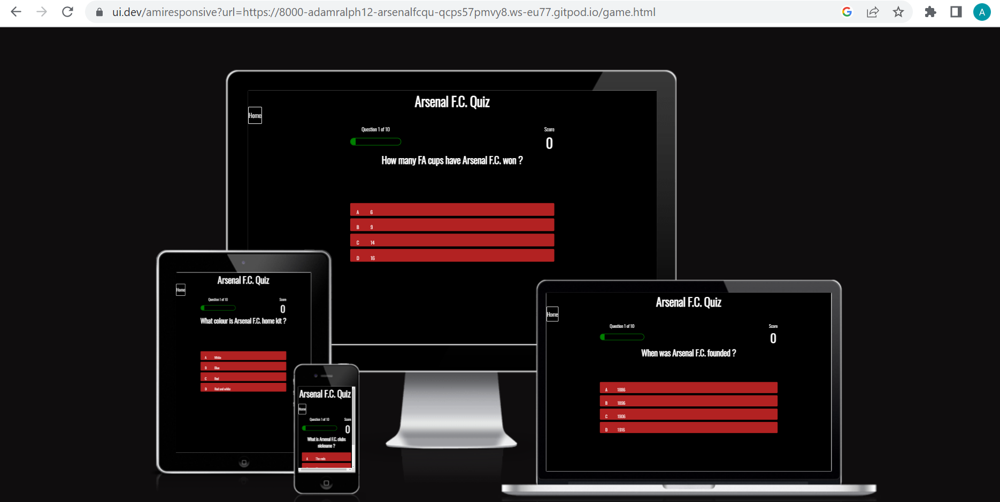

# Portfolio project - 2 JavaScript

# Arsenal F.C. Quiz

Welcome to my Arsenal F.C. Quiz! This is a quiz for those who have an interest in Arsenal F.C. or those who would like to know more about the club. It is an interactive quiz thats tells you the correct answer when a questions is wrong and keeps track of your score and what number question you are on.

# Table of contents
1. [Overview](#overview)
2. [Features](#features)
    * [Header](#header)
    * [Index page](#index-page)
    * [Footer section](#footer-section)
    * [Quiz page](#quiz-page)
    * [End page](#end-page)
    * [Highscores page](#highscores-page)
3. [User stories](#user-stories)
4. [Technology used](#technology-used)
5. [Testing](#testing)
    * [Code validator](#testing)
    * [JavaScript (JS hint)](#javascript-jshint)
    * [Css (Jigsaw)](#css-jigsaw)
    * [HTML (W3C validator)](#html-validator-w3c)
    

